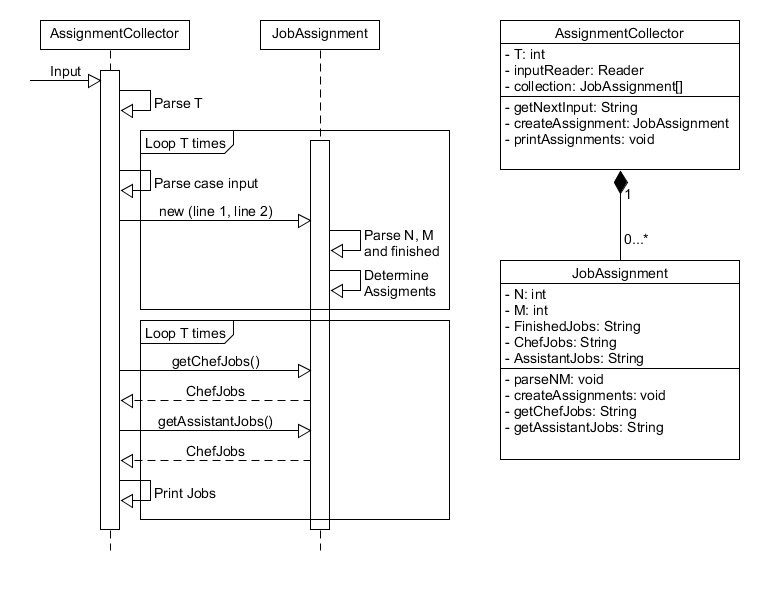

# Design Document

This isn't a huge problem, of which we could steam roller our way through in a procedural fashion. Since I'm doing this in Java however, I'll try to be as OO as I can. Might be overkill but still good practice.

## Breakdown

There seems to be two distinct objects to work on. The first is the overall system/framework which is some sort of collector of job/task lists. So my initial thoughts are to build two classes...

* AssignmentCollector
* JobAssignment

## PseudoCode

- Get T from the input.
- For Each T.
  - Get input line 1 of T (N and M).
  - Get input line 2 of T (list of finished jobs).
  - Create a JobAssignment for that T.
  	- parse line 1 for N and M.
  	- Parse line 2, mark finished jobs.
  	- Process, assign jobs to either the Chef or Assistant.
 - Output results of each T in the collection.
	
## Errors 

Being strict since there is no one to ask about odd situations...

* Each line must follow a specified format, anything outside said format either errors or is discarded.
* Ignore extra values (eg, more test cases available than specified). The input is System.in so extra values may be for the next process so don't grab input that isn't ours.

Error when...

- Unexpected Input
  - T, N or M are outside their respective bounds.
  - Values provided are of incorrect type.
	
## Initial Diagrams

This is an initial design, exact process, methods, names, etc may change but it's what we'll build from. 

